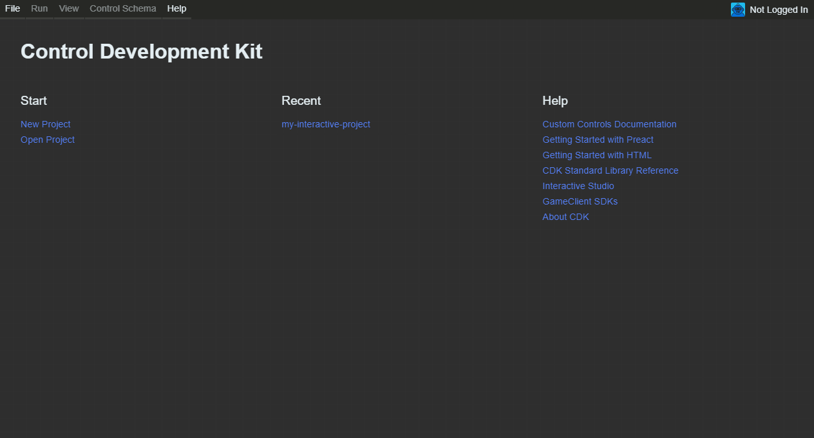

## Introduction

Writing with pure HTML and JavaScript is the fastest and easiest way to get started building rich custom control experiences for Mixer. Well cover setting up a project, making some changes, and running it on Mixer.

## Quickstart

### Prerequisites

You first need to [install Node.js](https://nodejs.org/en/download/) on your computer. We require Node.js version 8.0.0 or higher. Node.js lets you run our build scripts and tools. Youll also need a decent code editor. We recommend [Visual Studio Code](https://code.visualstudio.com/) as a powerful editor with great JavaScript support out-of-the-box.

### Downloading the Control Development Kit

After Node.js is installed youll need to download our Control Development Kit (CDK). The CDK powers custom control development with an integrated set of tools such as previewing, testing and more. You can download the CDK [here](https://aka.ms/MixerCDK). Once youve downloaded the installer, double click on it to open it. This will install and then run the CDK.

### Create a Project

Once the CDK is running youll see the following screen:


Custom Controls are stored within Projects in the CDK so the first step is to create a new project. To do this select the new project option in the File menu along the top of the CDK. This will launch a wizard which will guide you through the steps to create your new project.

First, select the folder that the project will be created in. We recommend you create a new folder to store all of your Custom Control projects so that they are organized. For example you could put them in `D:\dev\custom-controls\`.


Next, you will be asked to choose your Starter Template. For this guide choose, the [HTML template](https://github.com/mixer/cdk-html-starter).

You will be asked to choose a control layout. For this guide, please select "Full Screen".

Youll then be asked to enter some details about your project; feel free to fill these in. This is your chance to explain what the project is about.

Once youve clicked "Create My Project", the CDK will spin up a new project for you. This will download the template and install its dependencies. This will take a few moments. Behind the scenes here were setting up your new project as a standard [NPM Module](https://docs.npmjs.com/getting-started/creating-node-modules) which is built using [Webpack](https://webpack.js.org/).

The CDK will tell you when the installation completes, and give you the option to open your projects folder in an IDE (if it can detect one) or in your file browser. You can also do this at any time by clicking your project name in the top action bar of the CDK and selecting "Open Folder".

### Login

In order for some parts of the CDK to work such as uploading or publishing you need to login to the tool with your Mixer user account. We recommend you do this now so that it is done and you dont need to to worry about it. Click the "Not Logged In" Icon in the top right of the CDK to begin the login process.

Once everything has been completed, the CDK will show you the HTML Starter in a preview State within its UI. Each time you make changes to your custom control code it will detect this change and update the preview to show you the new output.

If you havent done already, you should now open your new project in your favorite code editor. Were now ready to take a look at some code.

Lets look at whats going on in `scripts.js`:

```js
window.addEventListener('load', function initMixer () {
    // Move the video by a static offset amount
    const offset = 50;
    mixer.display.moveVideo({
        top: offset,
        bottom: offset,
        left: offset,
        right: offset,
    });

    // Whenever someone clicks on "Hello World", we'll send an event
    // to the game client on the control ID "hello-world"
    document.getElementById('hello-world').onclick = function (event) {
        mixer.socket.call('giveInput', {
            controlID: 'hello-world',
            event: 'click',
            button: event.button,
        });
    };

    mixer.isLoaded();
});
```

`mixer.display.moveVideo(...)` tells Mixer to move the video container so that it is 50 pixels from the edges of the stage. One of the coolest things you can do from a custom control is resize the video to make the experience you want!

`mixer.socket.call(giveInput, ...)` activates whenever you click on the "Hello World" text. This method sends a `giveInput` message down to the game client. To learn more about sending messages between a control and the game client, check out the [game client communication documentation](/guides/mixplay/customcontrols/gameclients).

`mixer.isLoaded()` tells Mixer that your control has loaded. Its best to do this when youre finished setting up and loading in any images or scripts. Viewers on Mixer wont see your control until `isLoaded()` is called.

In summary, we position the video on the stage, setup a handler to send custom data back to the game, and then tell Mixer the control is ready to be seen by the world.

### Make a Change
Now that weve gone over the basics, lets make an overlay that automatically resizes itself to always be over the video - even when the browser window changes!

!!!  Automatically resizing and adjusting to the size of the browser is called _responsive development_ and is very important in building custom controls. You can read more in our [best practices](/guides/mixplay/customcontrols/bestpractices).

Lets talk strategy: our goal will be to place a semi-transparent `div` completely covering the real position of the video, independant of the size of the browser window or the aspect ratio of the video source. To do that, were going to use the `position()` API, which provides a handy observable for the real position of the video. Whenever that updates, well move our `div` so that it aligns with the video position.

To start, we need an element to overlay on top of the video. Well add an overlay `div` to `index.html` by replacing the file contents with the following:

```html
<!DOCTYPE html>
<html lang="en">
<head>
    <meta charset="UTF-8">
    <meta name="viewport" content="width=device-width, initial-scale=1.0">
    <title>My Awesome Interactive Integration</title>
    <script src="https://mixercc.azureedge.net/lib/std-v0.2.js"></script>
</head>
<body>
    <div id="overlay" style="background-color: rgba(0, 0, 0, 0.3); position: absolute;">
        <button id="hello-world">Hello world!</button>
    </div>

    <script src="./scripts.js"></script>
</body>
</html>
```

Next, we need to setup the handler for when the window position changes that moves and resizes the `div` to the correct location on the video. Add the `handleVideoResized()` function to the end of `scripts.js`:

```js
function handleVideoResized (position) {
    const overlay = document.getElementById('overlay');
    const player = position.connectedPlayer;
    overlay.style.top = `${player.top}px`;
    overlay.style.left = `${player.left}px`;
    overlay.style.height = `${player.height}px`;
    overlay.style.width = `${player.width}px`;
}
```

Lastly, lets tie it all together. At the top of the `initMixer()` function, add the following. This will subscribe our handler function to updates and does the initial positioning of the overlay.

```js
mixer.display.position().subscribe(handleVideoResized);
```

All together, heres our `scripts.js` file:

```js
window.addEventListener('load', function initMixer () {
    mixer.display.position().subscribe(handleVideoResized);

    // Move the video by a static offset amount
    const offset = 50;
    mixer.display.moveVideo({
        top: offset,
        bottom: offset,
        left: offset,
        right: offset,
    });

    // Whenever someone clicks on "Hello World", we'll send an event
    // to the game client on the control ID "hello-world"
    document.getElementById('hello-world').onclick = function (event) {
        mixer.socket.call('giveInput', {
            controlID: 'hello-world',
            event: 'click',
            button: event.button,
        });
    };

    mixer.isLoaded();
});

function handleVideoResized (position) {
    const overlay = document.getElementById('overlay');
    const player = position.connectedPlayer;
    overlay.style.top = `${player.top}px`;
    overlay.style.left = `${player.left}px`;
    overlay.style.height = `${player.height}px`;
    overlay.style.width = `${player.width}px`;
}
```

Thats it! Go back to the CDK and you should see the overlay being positioned properly.

You can try changing the emulated device to see how your changes look on different devices. To do this, open the view menu at the top of the CDK and select "Device Emulation". In the panel that opens, try changing the device to a Phone or tablet and watch your overlay resize automatically.

### Next Steps
- Read more about [sending data between a custom control and a game client](/guides/mixplay/customcontrols/gameclients)
- Check out the [best practices for building custom control experiences](/guides/mixplay/customcontrols/bestpractices)
- Learn about [testing and publishing custom control bundles](/guides/mixplay/customcontrols/workflow) for when you're ready to go big with your integration
- Ask questions and get help [on Gitter](https://gitter.im/Mixer/developers)