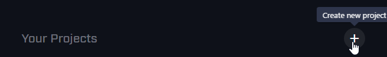
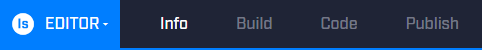
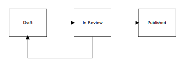

# MixPlay

## Introduction

Mixer Interactive enables viewers, also known as participants, to directly control the environment in and around streamer’s broadcasts by interacting with user interface controls. When a broadcast has interactivity enabled, controls appear beneath the video on the viewer’s screen. These controls dynamically change according to live events and update in response to different situations that occur within the broadcast.

Developers and producers can create interactive experiences which can run as a part of a game, entirely as a standalone application, or as a tool. These experiences are then used by broadcasters to make their broadcasts interactive.

When a viewer interacts with the controls, their input is sent directly to the experience, allowing the developers to see exactly who is interacting and what they are doing. This level of engagement allows for the creation of truly unique and interactive experiences that let viewers and broadcasters experience Mixer broadcasts on a whole new level.

## Getting Started

Interested in making an Interactive Project? Let's get started!

### Prerequisites
Before you begin, we recommend that you have:

- [A Mixer user account](https://watchbeam.zendesk.com/hc/en-us/articles/208104776-Creating-an-Account)
- Some knowledge of programming, unless you're using an existing Game Client or Interactive Application
- An awesome idea or existing code base or game to work from

### Choose a SDK

If you're making a Game Client from scratch, you'll need to use an Interactive SDK.

| Environment | Repository / Download | Documentation | Description |
| ----------- | ----------------------|---------------|-----------------|
| Typescript, Node.js & Browsers | [GitHub](https://github.com/mixer/interactive-node) | [API Reference](https://mixer.github.io/interactive-node) | Great for creating Interactive tools and utilities. Suitable for beginners. |
| C++ | [GitHub](https://github.com/mixer/interactive-cpp) | [API Reference](/reference/interactive/cplusplus/index.html)  [Docs & Getting Started](https://aka.ms/MixerCPPDocs) | Add Mixer Interactive features directly into a C++ Game. |
| Unity | [Asset Store](https://www.assetstore.unity3d.com/en/#!/content/88585) | [API Reference](/reference/interactive/csharp/index.html)  [Docs & Getting Started](https://aka.ms/MixerUnityDocs) | Add Mixer Interactive features into a game created using Unity. Also great for quickly prototyping an Interactive Idea. 
| Unreal Engine 4 | [GitHub](https://github.com/mixer/interactive-unreal-plugin) | [Documentation and Getting Started](https://aka.ms/MixerUnrealDocs) | Add Mixer Interactive features into a game created using Unreal Engine 4. |
| Java | [GitHub](https://github.com/mixer/interactive-java) | [API Reference](https://mixer.github.io/interactive-java) | Add Mixer interactive to your Java project. |

Download the appropriate SDK that your project needs from the repository and create a new project in your favorite IDE.

### Create a new Interactive Project

Interactive projects are created and configured in the [Developer Lab](https://mixer.com/lab/interactive).

Go to the [Developer Lab](https://mixer.com/lab/interactive) and click on the #[strong plus] button to create a new project.

    p.caption Screenshot shows the location of the Create new project button.

You'll then be prompted to enter a name for your project. Enter a suitable name for your project.

After creating the project, you can still modify your project using the editor.

### Configure, build, and publish the project
The project editor contains tabs where each tab is a step in the creation of your project. Use the project editor to configure, build, and publish your project.

The editor consists of these four tabs:

- Info - Edit the project name and metadata
- Build - Configure Scenes and Controls
- Code - Hook your Game Client up to the Project and start coding
- Publish - Submit your project for review by the Mixer team.

### Info
The info step is your opportunity to describe your project and provide potential users with all the information they need to get up and running.
It is important to describe what your project does and how to install it in a clear and concise way so that users understand what you have developed and how to use it. Be sure to include some information on how users can contact you if they need help or want to report an issue.
During the pre-publish review process, the Mixer team examines your project more closely. We use this information to gain an understanding of what your project does, so be as thorough as possible.

### Build

The build step is where you design your scenes and controls for your project. The interface is divided up into three sections:

- Scenes
- Controls
- Grid

#### Scenes section

This is where you'll manage the scenes for your project. Scenes can be created, renamed, or deleted here. You can also select a specific scene that you would like to manage controls for.

#### Controls section

This is where you'll manage the controls in your project. You can create, rename, change the type, adjust properties, or delete controls here.

#### Grid section

The grid is how you specify the layout of your controls for the scene. There are three different layouts for which you can set the look of the scene: small (mobile phones), medium (tablets), and large (desktops). These different layouts are indicated by icons in the upper left area of the grid section.

To add a control to the grid, click and drag the control from the Controls section on to the Grid section. Once the control has been added to the grid you have the ability to resize, reposition, or remove the control.

For more detail on the configuration of the controls on the scene, the `View JSON` option in the top right of the grid section will display the relevant JSON for the scene.
Once you are finished building your scenes/controls, press the Save button in the top right of the grid section.

### Code
The code step is to help you complete the code portion of your project. This is usually done after you have set up the scenes and controls. This is also where you can grab the `Project Version ID` which is displayed in the center of the screen.

You will need to write your own Game Client to connect to the Interactive service. For SDK downloads, documentation, and samples, go to [Choose a SDK](#choosing-an-sdk-environment).

### Publish
The final step in the studio is Publish. Publish allows you to share your project with everyone on Mixer.

To help you decide whether your Interactive project is ready for publishing, these are some questions to ask:

- Is your project something that everyone would use?
- Is your project ready for every Mixer broadcaster to have access to?
- Have you filled in the Info tab with #[strong detailed] installation and setup instructions?

If you’ve answered no to any of the questions above, you should #[strong not] publish your project yet. If you would like to have a small group of users to be able to access it, consider [sharing](#sharing-your-project) your project instead.

#### Understand the Publishing Flow

A Project starts off as a draft. In this state, you are free to edit, test, and share it with other users. Many projects don't leave the draft state. It's perfectly ok not to publish your project.

When you've decided to publish your project, go to the Publish tab in the interactive studio. It will perform some checks on the project to ensure that it meets some basic requirements before allowing you to click on the Submit button.
Once you've submitted your project, the Interactive review team at Mixer is notified, and we will begin the review process. While a project is in review, you won't be able to edit the project. A Mixer representative may also reach out to you with questions.
After a review is conducted, you'll be notified whether your project is accepted for publishing or not. If your project is not accepted for publishing, it goes back to the draft state with feedback from the team, detailing what needs to change so that your project can be successfully published.
Once your project is accepted for publishing, we can start discussing the actual launch date; when you would like to make your project available for all Mixer users in the Interactive Store.

## Interactive Overview

Four major components make up an interactive experience:

1. Game Client
1. Interactive Service
1. Interactive Project
1. Participants

        p.caption Diagram showing the structure of an interactive project

### The Game Client
A Game Client is software code which processes interactive events. It is written by developers who want to create an interactive experience. Game Clients connect to the [Interactive Service](#the-interactive-service) and listen to events and updates sent from the service to take action within their environment, thus affecting the broadcast.

A Game Client can be created for a variety of environments, such as:

- Within a game's current codebase
- In a third party mod of a game
- As a standalone application
- As a game's server-side service

### The Interactive Service

The Interactive Service is a service operated by Mixer. A Game Client connects to it to create an interactive session. Once a session is established, the service acts as a mediator for the Interactive session. The service manages data flow and state within the session by processing and distributing data sent to and from both the [Game Client](#the-gameclient) and [Participants](#participants). The Game Client sends messages to the service when it needs to update the session state or to interact with the session.

### An Interactive Project

An Interactive Project stores settings and metadata about an interactive experience. They are created by developers through the [Developer Lab](https://mixer.com/lab/interactive). Projects are owned by a single Mixer user but can be [shared](#sharing-your-project) with other users.

Within the Studio you can:

- Edit your project's name and description
- Create and store controls and scenes
- Control who can access your project
- Publish your project for everyone on Mixer to see and use

When a [Game Client](#the-gameclient) connects to the Interactive Service, it provides your project's ID to the service. The service reads this ID and sets up an interactive session with the saved settings and controls created in the Studio.

### Participants

Participants are viewers of a live stream. They are Mixer users watching a broadcast in a broadcaster's channel. When they join the channel, they are connected to the interactive session. They are provided with the controls within the Project, that they can use to affect the broadcast. A [Game Client](#the-gameclient) can react to events and interactive input to change the controls that are displayed to participants.

## Interactive Experience Structure

An Interactive experience contains hierarchical structure of various elements.

These elements are:

- Scenes
- Controls
- Groups
- Participants

    p.caption Diagram showing the relationship between elements in the interactive hierarchy.

## Scenes

A scene is a named collection of controls. Within a scene, controls are arranged on a grid. The grid's layout determines how the controls are displayed to participants.

The [Game Client](#the-gameclient) can add or remove controls from a scene. It controls which scenes (and controls) are shown to which participants throughout the session. Scenes are used to group controls together in a coherent fashion that is meaningful to the experience.

For example, in an adventure game, you might have a "Battle" scene displayed when a broadcaster's game character is in battle; a "Field" scene displayed when the character is walking around in the game world.

All [Interactive Projects](#an-interactive-project) have a default scene. Without any intervention from the [Game Client](#the-gameclient), all participants and [groups](#groups) are shown the default scene.

The [Game Client](#the-gameclient) can change the scene that a participant sees by updating the [group](#groups) they belong to.

## Groups
Individual participants can be segmented into groups. Participants within a group all see the same Scene and contribute input to the controls that are part of that scene. [Game Clients](#the-gameclient) can create and update groups any time, including changing the scene that the group is set to see. A participant can only be a member of one group at any time.

Groups can be used to create team-based experiences where groups compete to achieve a goal within the experience. Using an adventure game again as an example, you could create an "Allies" group and an "Adversaries" group.

The "Allies" group is provided with controls that gives them the ability to heal the character that the broadcaster is controlling or grant buffs to increase their chance of winning. Alternatively, the "Adversaries" group could spawn traps or monsters to try to get in the way of winning - using their controls.

Participants always start out in the default group but [Game Clients](#the-gameclient) can re-assign participants into any group.

## Controls
A control is an interactive element in a user interface within a scene. [Participants](#participants) can interact with the control using touch, keyboard, mouse, or controller. There are currently a variety of types of controls including Buttons, Joysticks, Labels, & Textboxes. Additional control types may be added in the future.

### Buttons

A button is a rectangular, interactive control within a scene. [Game Clients](#the-gameclient) receive events when participants interact with a button.

- `mousedown` event is sent when a button is pressed by a participant
- `mouseup` event is sent when a button is released by a participant
- `keydown` event is sent when the key (specified via key code on the button) is pressed by a participant
- `keyup` event is sent when the key (specified via key code on the button) is released by a participant

    p.caption Sample button control which costs the participant one spark if they click on it.

Developers can use buttons to enable participants to vote, cause in-game actions to happen, or control in-game entities.

Buttons are highly customizable. These button properties can be edited from both the Interactive Studio and a Game Client:
1. Text displayed on the button
1. Spark cost (For more info about sparks, see [What are sparks?](#what-are-sparks))
1. Width of the progress bar, which is displayed at the bottom of a button
1. Disabled state - Buttons which are disabled cannot be interacted with
1. Cooldown duration - Prevents interaction until it expires
1. Key code - A keyboard key assignment to a button
1. Tooltip displayed when hovering over the button
1. Color of the background on the button
1. Color of the border on the button
1. Accent color applied to the cooldown spinner and progress bar
1. Focus Color applied to the border when focusing
1. Color of the text display on the button
1. Size of the text display on the button

### Joysticks

Joysticks are circular controls positioned within a scene that participants can click and drag. Moving a joystick sends an input event down to the Game Client with the coordinates of the joystick relative to its center. Joystick coordinates range between `-1 and 1`.

    p.caption An idle joystick displayed to a participant. Its coordinates are `0, 0`.

    p.caption An illustration of the coordinate system for joysticks. The top left is `-1, -1` and the bottom right is `1, 1`.

### Labels

Labels are controls which can be used to display instructions and visually group controls together. As an example, a scene with buttons that either hurt or heal the player can have each section clearly labeled respectively above the buttons.

    p.caption Sample label control that is bold and italicized.

Labels are customizable. These label properties can be edited from both the Interactive Studio and a Game Client:
1. Text displayed in the label
1. Size of the text in the label
1. Color of the text in the label
1. Whether the label is underlined
1. Whether the label is italicized
1. Whether the label is bold

### Textboxes

Textboxes are controls which can be used to get text input from participants. [Game Clients](#the-gameclient) receive events when participants either type or submit the text.

- `change` event is sent when the participant types in the textbox (This is not sent if the button has a submit button)
- `submit` event is sent when the participant submits the textbox

    p.caption Sample textbox control asking participants to enter their pet's name, costing 10 sparks to submit.

Textboxes are customizable. These textbox properties can be edited from both the Interactive Studio and a Game Client:

1. Placeholder text display inside the textbox
1. Text displayed in the submit button associated with the textbox
1. Whether the textbox is multiline
1.  Whether the textbox has a submit button
1. Disabled state - Textboxes which are disabled cannot be interacted with
1. Cooldown duration - Prevents interaction until it expires
1. Spark cost (For more info about sparks, see [What are Sparks?](#what-are-sparks))

### Mouse

Mouse input allows you to get mouse events over video.  The mouse input control is pretty simplistic.  You can subscribe to receive mouse move on:

- `mousedown` (default) - this will only send mouse move events during a mousedown event
- `always` mouse move events are sent on hover and during mousedown
- `never` never send mouse move events.  You will still receive click events.

You can also adjust mouse move event throttling.  The `moveThrottle` duration, given in milliseconds, will throttle movement events sent to the game client.  The default is 50ms.

### Looking for More Customization?

If you're looking for more customization and more options for your interactive controls then checkout our new [Custom Controls](/reference/interactive_next/index.html) feature. It lets you create awesome experiences that are 100% custom and written in HTML, JavaScript and CSS.

## Managing Project Access

By default, only the owner of an Interactive project can use the project in a broadcast, access it from and SDK or make edits to it within the Interactive Studio. The goal of this restriction is to protect your project and ideas from access by unauthorized users. Mixer provides several options to expand project access to different groups of people in order to let them use the project or edit it.

### Sharing an Interactive Project
By default you are the only person who can broadcast the project. Other users will receive a `4020` Error code with the message: `The interactive version is not found, or you do not have access to it`

If you'd like other users and developers to be able to use your project then you have several options, which are managed in the project's share settings.

To open these settings, click the Share icon on the top right of the Studio, as shown in the screenshot

You'll be presented with a dialog with three options. #[strong Changing the sharing settings of a project will delete any previous share settings]

The first option, "Nobody can play this game until published", is the default. Selecting this option allows only the project owner to use the project in a broadcast until it is published. If you haven't opened these settings before then this will be the selected option.

#### Share Codes
The second, "Anyone with the versionId and code can play", option generates a share code. Share codes can be saved within your SDK's configuration and stored within your project's source control system and built into any in development builds of your project. Using this option allows for anyone in your team to easily work on the project.

You can also optionally give out this share code to smaller audiences to test or trial your project. If you do this you'll have to create a user interface or command within your game or application that can take this Share Code and pass it to your SDK of choice as a part of the SDK initialization.

Once a share code has been set it is very important to not change the radio button in this setting screen. If you do it will delete the share code and potentially lock other users or members of your team out from the project.

Once a project has been [published](#publishing-flow), you will not need the share code anymore. At this point #[strong any] Mixer user will have access to the project. Please ensure you go through the publishing process before your application or game is shipped to the public.

#### Explicit Sharing

The third option, "Only allow specific users to play until published", is called explicit sharing. It lets you share the project with named Mixer users. Only users in the list can use the project. To share a project with a specific user, search for their username in the search box and then click "Add".

The user #[strong must] have a Mixer User account for you to be able to share it with them. You can use this setting to share a project with a limited audience or with members of your team.

Changing this setting will #[strong delete] the list of authorized Mixer Users.

### Adding Project Editors

If you'd like other members of your team to be able to edit your Interactive project in the Interactive Studio then you should add them as a Project Editor. You can do this by clicking the project editors button in the studio.

In the dialog that opens you can search for other Mixer users and add them to your project as an editor. Once added you can also remove them.

Users added to this dialog will see your project in the project list of the studio. They can then edit the project as though they owned it.

### Project Access Best Practices

#### Project Sharing

- Use Explicit sharing for very small audiences.
- Use Share Codes when your audience grows larger.
- Include your share code into your project's version control system. This way it'll be shared with anyone working on the project.
- Avoid changing your share code after one is in use. This will potentially lock out other people on your team.
- Before releasing your Game, [Publish your project](#publish-step).

#### Project Editors
- Create your project on an account for your Studio for example: "Mixer". This will make it look more professional when published.
- Add your Team's developers as Editors.
- Regularly review the editor list to ensure correct permissions.

## Sparks

### What are Sparks?

Sparks are Mixer's virtual currency. You can make controls and interactions in your Interactive Game or Application cost sparks for a participant by giving them a cost. When participants interact with controls that have a spark cost the cost is deducted from their spark balance.

### How are Sparks Earned?

Sparks are earnt by watching content on Mixer. Mixer users gain 2 sparks for every minute that they watch. Mixer broadcasters also earn sparks at the same rate. If a user subscribes to a channel or is a [Pro](https://mixer.com/pro) user then they'll earn double the rate of sparks (4 every minute).

### Can users buy Sparks?

Currently users cannot buy Sparks with real world money. That may change in the future, but we don’t have anything to share on those plans right now. If you have a cool idea for sparks, you can share your ideas on Sparks over on our [feedback site](https://feedback.mixer.com).

### Best Practices for Sparks

When placing a spark cost on a control it is important to remember to balance the cost against your Game or situation. For example Interactions that potentially impact game balance should be priced higher than those that are less impacting. What might be surprising is that the majority of Mixer users (more than 90%) have between 500 and 1,000. The next largest tranche of users has between 1,001 and 10,000 Sparks, followed by those with more than 10,000 Sparks, but that’s a very small (roughly 1%) of Mixer users.

### Spark Transactions

    p.caption Diagram of a spark transaction's life cycle, showing its transition between states.

When a button with a spark cost is pressed, it creates a transaction. To deduct sparks from a participant, a [Game Client](#the-game-client) must `capture` the transaction. If a transaction remains uncaptured for 5 minutes, it automatically expires, and the cost associated with the transaction is not deducted from the participant's spark balance.

This mechanism allows the [Game Client](#the-gameclient) to decide whether sparks should be deducted from a participant. This feature is a great way to ensure that input from a participant has been converted into the expected action associated with the button press before deducting sparks from their balance.

Note that deducted sparks are #[strong not] transferred to the broadcaster.

## Scale Considerations

When developing an Interactive experience it is very important to consider scale as a factor. Your experience might work perfectly for a small test stream where you and your team try some features out but Mixer broadcasts are different. You need to ensure that your experience scales for more public broadcasts. You should aim to think about 4 levels of Scale:

- Small Broadcasts - Less than 100 Viewers
- Medium Broadcasts - 100 - 1000 Viewers
- Large Broadcasts - 1000+ Viewers
- Events - Potentially 10s or hundreds of thousands of viewers

When thinking about these levels its important to ask yourself three questions:

- Is it fun?
- Is it balanced?
- Does it make sense?

Additionally, Special considerations need to be made for Events, if you're planning a large scale event that uses Interactivity please reach out and [contact us](mailto:mixerdevinfo@microsoft.com).

Mixer's interactive platform has several features that can help you deal with Scale.

### Throttling
For each event Mixer sends you from the Mixer Interactive Service you can set a bandwidth throttle. Bandwidth throttles control how fast data comes down from our service. Bandwidth throttles operate on a [leaky bucket algorithm](https://en.wikipedia.org/wiki/Leaky_bucket), and you can set various properties on the throttles to finely tweak how and when data comes down to your GameClient.

- `capacity` - How much data in bytes the throttle can hold before data is lost.
- `drainRate` - How fast the data drains from the bucket.

You can also set the capacity to 0 which would effectively disable this event from reaching you.

For an example of how this might be used consider a very large viewership Broadcast whose interactivity does not rely on the events sent when a participant joins the interactive session. You could turn these off which would prevent a lot of bandwidth as large amounts of users left and joined the stream.

Refer to your [chosen SDK](#choosing-an-sdk-environment), for documentation on how to set a bandwidth throttle on a particular event.

    // TODO: I know this is very basic but we can link to SDK docs when they exist. Right now calling it out is still a huge benefit.

### Scale Testing

    // TODO: This is a rubbish rubbish section, We need to do this as a feature item Playbooks V2 anyone? Its here to encourage people to talk to us though.

If you'd like to test your Experience at scale then our team can help. We can work with you to arrange a test session with some of our team or even one of our Partnered broadcasters. Additionally we have some internal testing tools that we can work with your team to run against a test build of your game. If you'd like to find out more please [reach out at to us](mailto:mixerdevinfo@microsoft.com).

### Interactive Game Design
It is important to factor Interactivity directly into your game design and we'd love to help out with that. To start with you can checkout our [Game Design with Mixer](/reference/interactive/design.pdf) booklet.

If you've got a cool idea for Mixer and your game please also [reach out to our team](mailto:mixerdevinfo@microsoft.com), we'd be happy to discuss ways to make your game awesome with Mixer.

## Protocol Overview

Mixer's Interactive protocol is defined in a separate [downloadable document](/reference/interactive/protocol/protocol.pdf) that has precise implementation details. This section provides an introduction to the protocol.

### Wire Format
The Interactive Service communicates using a protocol similar to [JSON-RPC](http://jsonrpc.org/historical/json-rpc-1-2-proposal.html) except that it is bi-directional. Clients and Servers can both call and respond to methods.

The protocol operates over a standard WebSocket connection. Both [Participants](#participants) and [Game Clients](#the-gameclient) use the same protocol definition, but different subsets of methods are available to each.

### Packets
The protocol contains two types of packets: `methods` and `replies`.

#### Method
A method is a request for a connected entity to perform an operation. Methods are sent by both the client and the server. When a method is received, it is processed and acknowledged by the recipient, who can then reply to the method with a result or an error.

A method can contain parameters which get provided to the recipient.

Methods contain an additional property called `discard`, which when `true`, indicates that the recipient can choose not to respond. Methods that can be treated as events have the `discard` property set to `true`.

#### Reply
A reply is sent from a recipient back to the caller informing them about the result after executing the method that was sent. It can contain a `result` or an `error` which indicates what went wrong.

For full packet implementation details, please refer to the protocol specification which you can download [here](/reference/interactive/protocol/protocol.pdf).

### Compression
By default, packets on the wire are transmitted as plain text, but the Game Client can opt to use [GZIP](https://tools.ietf.org/html/rfc1952) or [LZ4](https://lz4.github.io/lz4/) compression. To do this, the Game Client must call a method providing its supported compression formats. The server will then respond with its chosen compression format.

### Authentication
A Game Client needs to authenticate as a Mixer user when establishing an interactive session. There are two authentication methods available.

#### OAuth 2.0
Mixer supports [OAuth 2.0](https://tools.ietf.org/html/rfc6749) flows which enable you to get a valid [OAuth 2.0 Bearer](https://tools.ietf.org/html/rfc6750) token. Tokens can be passed in the `Authorization` header when you initiate a connection to the interactive service.

The only required scope for an interactive connection is `interactive:robot:self`. For more information about Mixer's OAuth, go to [OAuth reference page](/reference/oauth/index.html).

#### XToken
You can provide a Xbox Live XToken in the `Authorization` header when you initiate a connection to the interactive service. This authentication method is useful for Universal Windows Platform (UWP) applications that are Xbox Live enabled, as well as games on Xbox One.

## Where to get help
Have questions? Stuck? We're here to help! We have places you can get help so drop by!

- [Gitter](https://gitter.im/Mixer/developers) - Chat with our team and other developers.
- [Community Discord](https://discord.gg/mixer) - Hang out with other developers in our community Discord.
