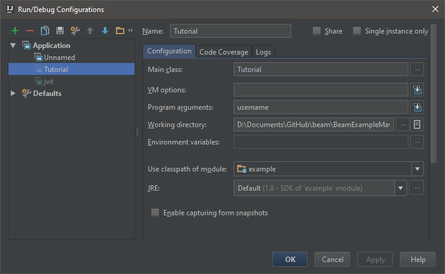

# Basic Tutorial - Let's write a Ranker!

This guide will walk you through the process of developing a bot which shows the tells the user their rank on Mixer, based on how many total viewers they have.

## Writing the Code

We’re going to be using our [Node](https://github.com/mixer/client-node), [Java](https://github.com/mixer/beam-client-java) and Python clients to build this app. The user will run it and it'll tell them how far they are from being the top streamer on Mixer!

[mixer-tabs active=1]

[mixer-tab title="Node"]
## Prerequisites
- Get [NodeJS and NPM](https://nodejs.org/en/) for your operating system/platform.
- Create a [new project](https://docs.npmjs.com/cli/init) with npm.
- Run `npm i -S @mixer/client-node`

## Usage
Let's start by importing all of the modules which we'll need.

```js
'use strict';

const Mixer = require('@mixer/client-node');

const client = new Mixer.Client(new Mixer.DefaultRequestRunner());
```

To get the user's channel name we'll ask for it from the command line and use this to make a REST request that will provide a response with their channel details. We'll then print out how many viewers the have on their channel.

```js
'use strict';

const Mixer = require('@mixer/client-node');

const client = new Mixer.Client(new Mixer.DefaultRequestRunner());

const channelName = process.argv[2];

client.use(new Mixer.OAuthProvider(client, {
    clientId: 'Click here to get your Client ID!',
}));

client.request('GET', `channels/${channelName}`)
.then(res => {
    const viewers = res.body.viewersTotal;
    console.log(`You have ${viewers} total views...`);
});
```

You've already got working code that connects and talks to our API. Go ahead, try it! Run `node rank.js <your_username>` in your terminal.

```
$ node rank.js connor4312
You have 595 total views...
```

Now it's time to dig up all that stuff you learned in your computer science course. We want to sort the channels on Mixer by the number of viewers they have, and loop through until we find the first channel that has less viewers than we do. To do this we'll have to make several calls to the API, and in Node this kind of chaining is often done through recursion.

We define a function simply called `run` that we initially call with page `0`. Each time it makes a request, it'll count up the channels it gets back and stop when it gets a channel less or as popular as we are.

// ...
let rank = 1;
const run = (page) => {
    return getChannelsDescending(page).then(res => {
        for (let i = 0; i < res.body.length; i++) {
            const channel = res.body[i];
            if (channel.viewersTotal <= viewers) {
                console.log(`Your rank on Mixer is ${rank}!`);
                return;
            }

            rank++;
        }

        console.log(`Your rank is at least ${rank}...`);
        return run(page + 1);
    });
};

return run(0);
// ...
Now we just need to fill in that mysterious `getChannelsDescending(page)` function with a call on the Mixer client. The client has several helpers here that are essentially light wrappers around the [request](https://github.com/request/request) package. So, we'll pass options in that we read from the [channel endpoint docs](LINK TO REST) to do what we need:

// ...
const run = (page) => {
    return client.request('GET', '/channels', {
        qs: {
            page,
            fields: 'viewersTotal',
            order: 'viewersTotal:DESC',
        },
    }).then(res => {
// ...
All together now, you can put this together into a single script...
```js
'use strict';

const Mixer = require('@mixer/client-node');

const client = new Mixer.Client(new Mixer.DefaultRequestRunner());

const channelName = process.argv[2];

client.use(new Mixer.OAuthProvider(client, {
    clientId: 'Click here to get your Client ID!',
}));

client.request('GET', `channels/${channelName}`)
.then(res => {
    const viewers = res.body.viewersTotal;
    console.log(`You have ${viewers} total viewers...`);

    let rank = 1;
    const run = (page) => {
        return client.request('GET', '/channels', {
            qs: {
                page,
                fields: 'viewersTotal',
                order: 'viewersTotal:DESC',
            },
        }).then(res => {
            for (let i = 0; i < res.body.length; i++) {
                const channel = res.body[i];
                if (channel.viewersTotal <= viewers) {
                    console.log(`Your rank on Mixer is ${rank}!`);
                    return;
                }

                rank++;
            }

            console.log(`Your rank is at least ${rank}...`);
            return run(page + 1);
        });
    };

    return run(0);
});
```
...and run it to get your rank on Mixer!

```
$ node rank.js connor4312 l337hax0r
You have 595 total viewers...
Your rank is at least 51...
Your rank is at least 101...
Your rank is at least 151...
Your rank is at least 201...
Your rank is at least 251...
Your rank is at least 301...
Your rank is at least 351...
Your rank is at least 401...
Your rank is at least 451...
Your rank is at least 501...
Your rank is at least 551...
Your rank is at least 601...
Your rank is at least 651...
Your rank is at least 701...
Your rank is at least 751...
Your rank on Mixer is 761!
```
[/mixer-tab]

[mixer-tab title="Java"]
## Prerequisites
- Java 1.8 or above
- A Java IDE such as:
  - Eclipse
  - IntelliJ
  - NetBeans
- A Java Project Manager such as:
  - Maven
  - Gradle

## Project Setup
Set up a standard project for your environment and include [beam-client-java](https://github.com/mixer/beam-client-java) as a dependency.


To set up `beam-client-java` with **Maven**, first add the Mixer repo to your `pom.xml` as a repository as follows:
```
<repositories>
  <repository>
    <id>beam-snapshots</id>
    <url>https://maven.mixer.com/content/repositories/snapshots/</url>
  </repository>
</repositories>
And secondly, add this project as a dependency in your pom.xml:

<dependencies>
  <dependency>
    <groupId>com.mixer</groupId>
    <artifactId>api</artifactId>
    <version>6.0.0-SNAPSHOT</version>
  </dependency>
</dependencies>
```

To set up `beam-client-java` with **Gradle**, first add the Mixer repo to your `build.gradle` as a repository as follows:
```
repositories {
    maven {
        name = "beam"
        url = "https://maven.mixer.com/content/repositories/snapshots"
    }
}
```
And secondly, add this project as a dependency in your build.gradle:
```
dependencies {
    compile "com.mixer:api:6.0.0-SNAPSHOT"
}
```

## Usage
Let's start by creating a Main class for the Java application and importing all of the required packages. We'll also initialize an instance of the MixerAPI.

```java
import com.mixer.api.MixerAPI;
import com.mixer.api.http.SortOrderMap;
import com.mixer.api.resource.MixerUser;
import com.mixer.api.resource.channel.MixerChannel;
import com.mixer.api.response.channels.ShowChannelsResponse;
import com.mixer.api.services.impl.ChannelsService;
import com.mixer.api.services.impl.UsersService;

import java.util.concurrent.ExecutionException;

public class Tutorial {
    public static MixerAPI mixer;

    public static void main(String[] args) throws ExecutionException, InterruptedException {
        mixer = new MixerAPI("Click here to get your Client ID!");
    }
}
```

Next let's fetch the user's channel we'll grab their username off the command line. The Java Client uses a service orientated approach which means all channel related functions are on the `ChannelService`. So we need to `use` that service to get the channel data. Most methods that talk to the API return a [Java Future](http://docs.oracle.com/javase/8/docs/api/java/util/concurrent/Future.html). These are a form of asyncronous operation in Java. For this tutorial however we'll use the get method of a future to wait for the Future to complete. It returns a `MixerChannel` object. On the channel we can find the `viewersTotal` property which we can then print.

```java
//...
MixerChannel channel = mixer.use(ChannelsService.class).findOneByToken(args[0]).get();

int viewers = user.channel.viewersTotal;
System.out.format("You have %d total views...\n", viewers);

run(0,viewers,1);
//...
```

Now you've already got some working code!

To run your project you can use your Java IDE to create a run configuration that supplies the username as Program Arguments. If you're using IntelliJ it should look like this:


Next let's make a function which gets a page of channels from the API sorted in descending order based on total views.
```java
//...
public static ShowChannelsResponse getChannelsPage(int page) throws ExecutionException,InterruptedException  {
    SortOrderMap<ShowChannelsResponse.Attributes, ShowChannelsResponse.Ordering> map = new SortOrderMap<>();
    map.put(ShowChannelsResponse.Attributes.VIEWERS_TOTAL, ShowChannelsResponse.Ordering.DESCENDING);
    return mixer.use(ChannelsService.class).show(map,page,100).get();
}
//...
Finally, we can make a function that loops through the MixerChannel objects on the ShowChannelsResponse, until it gets to a channel that equal to or lower than you're rank. If this is not found we request the next page recursively.

When it finds such a channel, it'll log it to the console.

public static int run(int page, int viewers, int rank) throws ExecutionException,InterruptedException {
    ShowChannelsResponse channels = getChannelsPage(page);
    for (int i = 0; i < channels.size(); i++) {
        MixerChannel channel = channels.get(i);
        if (channel.viewersTotal <= viewers) {
            System.out.format("Your rank on Mixer is %d!\n", rank);
            return rank;
        }
        System.out.format("Your rank is at least %d...\n", rank);
        rank++;
    }
    return run(page + 1, viewers, rank);
}
```

To start the ranking process we just need to call `run(0, viewers, 1)` in the main method. All together you can put the code together into one Java Class...

```java
import com.mixer.api.MixerAPI;
import com.mixer.api.http.SortOrderMap;
import com.mixer.api.resource.channel.MixerChannel;
import com.mixer.api.response.channels.ShowChannelsResponse;
import com.mixer.api.services.impl.ChannelsService;

import java.util.concurrent.ExecutionException;

public class Tutorial {
    public static MixerAPI mixer;

    public static void main(String[] args) throws ExecutionException, InterruptedException {
        mixer = new MixerAPI("Click here to get your Client ID!");

        MixerChannel channel = mixer.use(ChannelsService.class).findOneByToken(args[0]).get();

        int viewers = channel.viewersTotal;
        System.out.format("You have %d total viewers...\n", viewers);

        run(0,viewers,1);


    }
    public static int run(int page, int viewers, int rank) throws ExecutionException,InterruptedException {
        ShowChannelsResponse channels = getChannelsPage(page);
        for (int i = 0; i < channels.size(); i++) {
            MixerChannel channel = channels.get(i);
            if (channel.viewersTotal <= viewers) {
                System.out.format("Your rank on Mixer is %d!\n", rank);
                return rank;
            }
            System.out.format("Your rank is at least %d...\n", rank);
            rank++;
        }
        return run(page + 1, viewers, rank);
    }
    public static ShowChannelsResponse getChannelsPage(int page) throws ExecutionException,InterruptedException  {
        SortOrderMap<ShowChannelsResponse.Attributes, ShowChannelsResponse.Ordering> map = new SortOrderMap<>();
        map.put(ShowChannelsResponse.Attributes.VIEWERS_TOTAL, ShowChannelsResponse.Ordering.DESCENDING);
        return mixer.use(ChannelsService.class).show(map,page,100).get();
    }
}
```
... and run it to get your Rank on Mixer!

```
You have 2279 total viewers...
Your rank is at least 1...
Your rank is at least 2...
...
Your rank is at least 281...
Your rank is at least 282...
Your rank is at least 283...
Your rank is at least 284...
Your rank on Mixer is 285!
```
[/mixer-tab]
[mixer-tab title="Python"]
## Prerequisites
- Python 3
- pip (Python Package Manager)

## Usage
Unfortunately we don't have a client library built for Python but, don't worry, the API is still super simple to use with the wonderful [requests](https://github.com/kennethreitz/requests) package. Go ahead and fire of `pip install requests` if you don't already have it installed.

First off, let's import what we need and make a login request to the API.

```python
import requests
import sys

s = requests.Session()
s.headers.update({'Client-ID': 'Click here to get your Client ID!'})

channel_response = s.get('https://mixer.com/api/v1/channels/{}'.format(sys.argv[1]))
```

We'll get back a HTTP response that includes a bunch of details about the channel. We'll print out how many viewers they have on their channel.

```python
import requests
import sys

s = requests.Session()
s.headers.update({'Client-ID': 'Click here to get your Client ID!'})

channel_response = s.get('https://mixer.com/api/v1/channels/{}'.format(sys.argv[1]))

viewers = channel_response.json()['viewersTotal']
print("You have {} viewers...".format(viewers))
```

You've already got working code that connects and talks to our API. Go ahead, try it! Run python rank.py <your_username> in your terminal.

```
$ python rank.py connor4312
You have 595 total viewers...
```

Next, let's make a function that loops the channel endpoint in descending order by total viewers, until it gets to a channel that equal to or lower than you're rank. When it finds such a channel, it'll return it.

```python
def channels_with_more_viewers(viewers):
    rank = 0
    page = 0
    while True:
        channels_response = s.get('https://mixer.com/api/v1/channels', params={
            'fields': 'viewersTotal',
            'order': 'viewersTotal:DESC',
            'page': page
        })

        for channel in channels_response.json():
            if channel['viewersTotal'] <= viewers:
                return rank
            else:
                rank += 1

        print("Your rank is at least {}...".format(rank))
        page += 1
```

All together now, you can put this together into a single script...

```python
import requests
import sys

s = requests.Session()
s.headers.update({'Client-ID': 'Click here to get your Client ID!'})

def channels_with_more_viewers(viewers):
    """Returns the number of channels that have more than `viewers` viewers.
    """

    rank = 0
    page = 0
    while True:
        channels_response = s.get('https://mixer.com/api/v1/channels', params={
            'fields': 'viewersTotal',
            'order': 'viewersTotal:DESC',
            'page': page
        })

        for channel in channels_response.json():
            if channel['viewersTotal'] <= viewers:
                return rank
            else:
                rank += 1

        print("Your rank is at least {}...".format(rank))
        page += 1


channel_response = s.get('https://mixer.com/api/v1/channels/{}'.format(sys.argv[1]))

viewers = channel_response.json()['viewersTotal']
print("You have {} viewers...".format(viewers))

rank = channels_with_more_viewers(viewers)
print("Your rank on Mixer is {}!".format(rank))
```
...and run it to get your rank on Mixer!
```
$ python rank.py connor4312
You have 595 total viewers...
Your rank is at least 51...
Your rank is at least 101...
Your rank is at least 151...
Your rank is at least 201...
Your rank is at least 251...
Your rank is at least 301...
Your rank is at least 351...
Your rank is at least 401...
Your rank is at least 451...
Your rank is at least 501...
Your rank is at least 551...
Your rank is at least 601...
Your rank is at least 651...
Your rank is at least 701...
Your rank is at least 751...
Your rank on Mixer is 761!
```
[/mixer-tab]
[/mixer-tabs]

## Where to go Next?

Now that you've successfully talked to our REST Api, the possibilities are endless!

- Check out our complete listings of endpoints and resources [here](/rest/index.html?target=_blank)
- Try Updating a Game or Channel Title, for this you'll need [OAuth](/reference/oauth)
