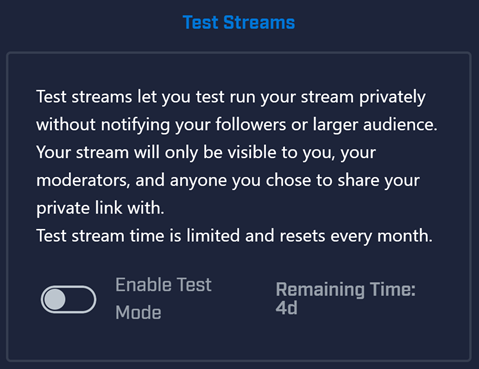

# Test Streams
Test streams allow you to broadcast your content in private. This means if you are working on an unannounced game or just want to try out some new streaming settings then you can use test streams to broadcast without anyone being able to see your content or broadcast.

## Test Stream Qualifications
Test Streams are currently available to a limited audience. To qualify for Test Streams, you must be a part of at least one of these groups:
1. Mixer Partner
2. Verifiable Mixer Developer (Integration, Chat Bots, etc.)
3. Microsoft/Xbox Partner

## Applying for Test Stream Access
If you're an Xbox, Microsoft, or Mixer Partner, please reach out to your Mixer contact so they can enable test streaming for you. Otherwise please follow these steps:
1. Visit the Mixer Developer Lab
1. Click the Test Streams tab
1. Fill out the displayed form and click Send Request
1. Once the form is submitted it will be reviewed by Mixer staff who will notify you if the feature has been enabled.

## Enabling Test Stream Mode
Once you've been granted access, to enable test stream mode:
1. Open the settings pane by clicking your profile picture in the upper, right of the mixer.com website.
1. Go to Manage Channel in the Setting pane.
1. In the Test Streams section, toggle Enable Test Mode.
1. Once you have enabled test stream mode you will see a bar on the top whenever you broadcast.
1. This bar will also contain a link you can share with others to view your stream.

Once you have enabled test streams for an account, it is enabled for every broadcast, across all devices. You don't need to enable test streams for each device you broadcast from. There is one, global setting applied to the account.

! Please note, when viewing a test stream on our mobile apps, only MixPlay will show. The video feed will not appear.

## Controlling Access
Whilst in test stream mode there are two ways to grant viewers access to view your test stream.

* By Making them a moderator in the channel - Moderators of your channel can see your test streams
* By Sharing out the access key link - At the top of your channel page whilst streaming in test stream mode is a banner which has a link in it. You can give this link out and those with the link will be able to access your test stream. This link resets for every stream.

## Best Practices
1. Use the `/clear` chat command at the end of the stream to clear chat.
2. Keep your access key / link secure. If you need to reset it, restart the broadcast to generate a new one.
3. Double check your moderators list before using test streaming. If someone is a moderator then they can see your test stream.
4. If in doubt use a separate account.
