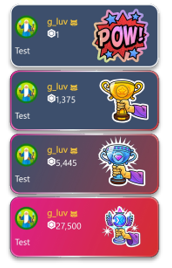

# Embers

!!! If you haven't already we suggest reading our [blog post](https://blog.mixer.com) first.

When we launched Season 2, [we announced](https://blog.mixer.com/2018/11/01/season-2/) several features coming to Mixer, the next feature on that list is here and its called Embers.

Embers are Mixer's new virtual currency that is powered by real world money. Users can purchase embers and then use them on Skills on partnered channels on Mixer. As with the launch of Season 2, we understand that developers may have questions and we'll be answering them on this page. If you have further questions please [drop us a line](mailto:mixerdevinfo@microsoft.com).

## Skills

With the launch of embers we've added a new collection of Skills. These Skills cost a varying amount of embers and are visually different from Spark based Skills.

### Attribution

One of the key changes with embers is that the use of an Ember's Skill can be accompanied by a message from the user that purchased the Ember Skill. This allows users to send a short message to the streamer with their Ember Skill. This message is shown in chat for the whole audience to see.

Higher priced ember skills are more noticeable in chat.

### Effects

Ember effects have the ability to be drawn over the channel page's video area which give them a lot more space to animate over.

As with Spark Effects, Ember Effects generate a ["SkillAttribution"](/reference/chat/events/skillattribution) Chat Event. This event indicates that the currency is "Embers" within the skill object.

### Stickers

Ember Stickers come in two varieties:

- Holographic - These stickers shine and shimmer within chat
- Animated - These stickers are fully animated.

Ember Stickers are sent through Chat as a [ChatMessage](/reference/chat/events/chatmessage). You can identify an Ember sticker by looking at the "skill" property within the message meta data. If the currency is "Embers" then the sticker is an ember sticker.

Ember stickers will also have a regular message fragment within the message array. This message is passed through CATBot before being sent.

## Moderation

Ember Skills can be moderated identically to regular skills with:
[cancelSkill](/reference/chat/methods/cancelskill).

## FAQ

### Can I use Embers within MixPlay?

Not today, we're looking for ways to make this a possibility in the future though. Standby for updates.

### Can I use Embers within my Third Party Product?

Not today, we're looking for ways to make this a possibility in the future though. Standby for updates.

