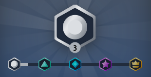

# Fan Progression

In Fan Progression enabled channels each user will earn experience points for interacting with channel. EXP will be earnt for various types of interactions including:
- Chatting
- Watching
- Spending Embers
- Subscribing
- etc?

With each rank increase a user gets a new badge next to their username in chat, this shows their rank and varies in color depending on the rank:



As developers you can learn more about a user's rank using our API.

## REST Endpoints

### Getting a user's Level

You can use GET `https://mixer.com/api/v1/ascension/channels/{channelId}/users/{userId}` to look up the rank of a particular user.

The response matches the payload of the [Level Up Constellation Event](/reference/constellation/events/live/fan%20progression).

### Getting a list of Levels
You can GET `https://mixer.com/api/v1/ascension/levels` to look up a list of levels. The response contains an array called `levels` whose members contain the following properties.


| Property | Type   | Description                                            |
| -------- | ------ | ------------------------------------------------------ |
| level    | uint   | The level number for this entry                        |
| minXp    | uint   | The minimum Experience points required for this level. |
| color    | string | A hexadecimal color code for the color of this level.  |
| complement    | string   | A hexadecimal color code for the complement color of this level.                            |
| assetUrl | string | A url path for the image for this level |

#### Example Level Object
```json
{
    "assetsUrl": "https://static.mixer.com/img/design/ui/fan-progression/v1_badges/silver/{variant}",
    "color": "#aaafb6",
    "complement": "#66A1F4",
    "level": 1,
    "minXp": 0
}
```

## Constellation Events

You can subscribe to the [Level Up Constellation Event](/reference/constellation/events/live/fan%20progression) to receive an event when a user levels up in a channel.


## Further Questions
If you have further questions please send us an [email]((mailto:mixerdevinfo@microsoft.com)).

