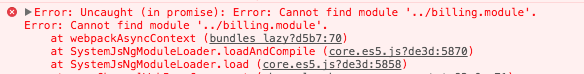

Our web frontend at Mixer is a large Angular application. It contains over 100,000 lines of our own hand-written code, along with a significant number of dependencies and a notable amount of generated code. While loading the entire application on a beefy desktop gaming PC is possible, trying to pull down and parse that code on lower-end computers, mobile devices, or Xbox consoles isn’t practical.

To solve this problem, Angular in conjunction with Webpack provides a way to lazy-load routes. For example, when you visit `mixer.com`, you won’t pull down all the content needed to display, say, `mixer.com/ChannelOne`; that’s loaded on demand when you navigate to ChannelOne’s page. This is a great first step and has served us well. However, while Mixer is a large application with lots of features, most of those are centered around one page: the channel page. So, for instance, whenever someone opened a channel page, we loaded:

- Interactive, even if the channel wasn’t Interactive;
- Billing logic and Braintree and Stripe payment gateways, even if the channel wasn’t a partner;
- Our "admin" dialog along with analytics and plotting libraries, even if the user wasn’t a Mixer staff member;
- and so on...

As we continue to add more features, it’s not scalable to load every feature when the channel page is opened. So, we set out on a mission to lazy-load on a per-module basis in Angular. Using this strategy, we were able to drop bundle sizes on the mixer.com channel page by 40%. This is how we did it!

> You can view a working example of the end result on Github here: [https://github.com/mixer/lazy-bundle-demo](https://github.com/mixer/lazy-bundle-demo)

Split them Bundles
Normally, we grab imports from other files with the `import` statement. Webpack looks through our files and sees who imports whom, and creates single-file bundles of JavaScript that the browser can load in. So for instance, in the module where the "Subscribe" button is, we’d import the BillingModule:

```javascript
import { BillingModule } from '../billing.module.ts';


@NgModule({
  imports: [
    BillingModule,
    // lots of other things ...
  ]
})
export class ChannelPageModule {
```

We want to split this out, so that the BillingModule isn’t imported until the user actually hits the sub button.

Webpack [provides](https://webpack.js.org/guides/code-splitting/#dynamic-imports) a useful way to handle code splitting, via the async variation of the `import` statement. We used the older `System.import` way of loading bundles for compatibility reasons, but its usage is the same. This is their example:

```javascript
return System.import('lodash').then(_ => {
  var element = document.createElement('div');
  element.innerHTML = _.join(['Hello', 'webpack'], ' ');
  return element;
}).catch(error => 'An error occurred while loading the component');
```

Fantastic! All we need to do is split our imports. Instead of importing the BillingModule in the base ChannelPageModule, we’ll load it at runtime using System.import. We then need to do some gymnastics to compile the module and create it, but it’s nothing we can’t handle. Condensed into one function, this is what our code for that looks like:

```javascript
import { Compiler, Injector, ViewContainerRef } from '@angular/core';

class SubButton {
  constructor(
    private readonly compiler: Compiler,
    private readonly injector: Injector,
    private readonly viewRef: ViewContainerRef,
  ) {}

  public async openSubDialog() {
    // 1. Import the module, then use the JiT compiler to compile it.
    // Everything after this step is Angular shenanigans.
    const { BillingModule } = await System.import('../billing.module.ts');
    const moduleFactory = await this.compiler.compileModuleAsync(BillingModule);

    // 2. Create an instance of the module, using the dependency injector,
    // then find the component we want. Little hack here: Angular doesn't
    // give us a way to directly look up a component factory by its name.
    const modRef = factory.create(this.injector);

    const factories: Map<Type<C>, { selector: string }> =
      (<any> modRef.componentFactoryResolver)._factories;
    const resolved = Array.from(factories.entries()).find(([, value]) => {
        return value.selector === 'b-subscribe-dialog';
    });

    // 3. Properly, get the factory of the function, and then create the
    // component itself and add it to the body!
    const factory = modRef.componentFactoryResolver.resolveComponentFactory(resolved[0]);
    const component = this.viewRef.createComponent(component, this.viewRef.length, this.modRef.injector);

    document.body.appendElement(this.compRef.hostView.rootNodes[0]);
  }
}
```

Okay, so not exactly pretty, but it cleans up well. We can write a service that handles loading for us, and another for dialogs, so the actual code where this is used looks something like this:

```javascript
import { Compiler, Injector, ViewContainerRef } from '@angular/core';

class SubButton {
  constructor(
    private readonly compiler: MixerDynamicCompiler,
    private readonly dialog: MixerDialogService,
  ) {}

  public async openSubDialog() {
    const factory = await this.mixerCompiler.compile(System.import('../billing'));
    this.dialog.open({ factory, selector: 'b-subscribe-dialog' });
  }
}
```

Now we have a split bundle that works well, we compile components on the fly, and our bundle sizes are down, high fives all around!

## Enter AoT

Angular has two compilers: the just-in-time (JiT) compiler and the ahead-of-time compiler (AoT) compiler. We use the JiT compiler in development for fast build times, and the AoT compiler in production for faster load times and static verification of our build. As we found out when we tried pushing the changes we mode above to staging, the AoT compiler is a _completely_ different beast from the JiT compiler, and Angular makes no effort to reconcile the two. To make matters more interesting, there is little to no documentation from here on out. Everyone knows how to compile JiT on the fly, the only thing that injects Webpack’d AoT on the fly is... the Angular router. Let’s dive in!

For running AoT compilations, we use Angular’s [@ngtools/webpack](https://www.npmjs.com/package/@ngtools/webpack) Webpack plugin. This is the same plugin that powers the Angular CLI, but we use it separately since our build process is a little more involved.

The first problem we run into is that the `Compiler` doesn’t work in AoT. They rightly expect that all your modules are already compiled, any use of the Compiler is surely a bug. When trying to call `compiler.compileModuleAsync`, we get the error:

> Error: Runtime compiler is not loaded

Okay, so that means that `System.import` is giving us the compiled modules, right? Nope! The pre-compiled modules are replaced with stubs. Inside the Webpack plugin, the Angular plugin actually rewrites all imported modules and components. It writes these to a virtual, in-memory filesystem, references obliquely in this issue. We can’t import those directly. But the Angular Router does it, so it must be possible.

After some spelunking around, we find a simple-looking class, the [RouterConfigLoader](https://github.com/angular/angular/blob/c2dbc55f115eb259a6d90e2b45ed61c329258c22/packages/router/src/router_config_loader.ts#L24). It uses the `NgModuleFactoryLoader`, which seems to replace `System.import` and should give us the module factory we used in step #2 above. That should work!



Webpack needs to be told about what modules it should bundle. In all webpack build configs you define an entry point and then Webpack looks through your source code to figure out what other files it should bundle and which other lazy-loaded modules it needs to create. Passing the bundle into the NgModuleFactoryLoader is, apparently, not enough to tell Webpack about the module–the Angular plugin doesn’t tell Webpack about it. But the Angular Router does it, so it must be possible.

Let’s dig into the plugin itself. _Something_ in there must be detecting and telling webpack about the additional modules it needs to compile. We find the lazy_routes.ts file, which seems to be what we’re after. It has a function which walks a source tree, looks for route definitions, and returns them. It’s called and passed into discoveryLazyRoutes. What if we just shim something in there?

```diff
@@ -35,6 +35,7 @@ export interface AotPluginOptions {
   locale?: string;
   missingTranslation?: string;
   transform?: FileTransform;
+  additionalBundles?: string[];

   // Use tsconfig to include path globs.
   exclude?: string | string[];
@@ -571,6 +572,15 @@ export class AotPlugin implements Tapable {
           ? this._getLazyRoutesFromNgtools()
           : this._findLazyRoutesInAst();

+        if (this._options.additionalBundles) {
+          this._options.additionalBundles.forEach(ref => {
+            const [relativePath, module] = ref.split('#');
+            const absPath = path.resolve(relativePath);
+            const entryDir = path.dirname(this.entryModule.path);
+            this._discoveredLazyRoutes[`${path.relative(entryDir, absPath)}#${module}`] = absPath;
+          });
+        }
+
         // Process the lazy routes discovered.
         Object.keys(this.discoveredLazyRoutes)
           .forEach(k => {
```

Now, we’re able to pass in the paths to the bundles in the AotPlugin configuration:

```javascript
plugins: [
  new AotPlugin({
    // ...
    additionalBundles: [
        path.resolve(__dirname, `../src/bundles/billing.module.ts#BillingModule`),
    ],
  })
],
```

Compile it, and... it works! Webpack picks up on the module, and we’re able to use the NgModuleLoader to bring it in and insert it. Add a loading state or two to account for the fact that once-synchronous operations are now asynchronous, and we’re just about good to go.

## All Together Now...

This is great and all, but we want to be able to make this work in both development (JiT) and production (AoT). The way bundles are loaded is, as mentioned, completely different. There are a few approaches we could take here. We previously added a [transformation function](https://github.com/mixer/angular-cli/commit/6f8967fb9b69d80d516f9cccc43b91ea48929f43) to @ngtools/webpack to allow us to change the code before Webpack or AoT sees it–we use this as a means of creating different builds for the Xbox and web applications with the help of the [preprocess](https://www.npmjs.com/package/preprocess) module. Using this, we:

1. Created those two different services for AoT and JiT, in [dynamic-comiler.service.ts](https://github.com/mixer/lazy-bundle-demo/blob/master/src/bundles/dynamic-loader/dynamic-compiler.service.ts).

2. Create a module that’s seen by the preprocessor, injecting either the AoT or JiT dynamic compiler based on the build configuration, in [dynamic-loader.bundle.ts](https://github.com/mixer/lazy-bundle-demo/blob/master/src/bundles/dynamic-loader/dynamic-loader.bundle.ts).

3. For ease of use, make a component that can load them up easily in the [dynamic-loader.component.ts](https://github.com/mixer/lazy-bundle-demo/blob/master/src/bundles/dynamic-loader/dynamic-loader.component.ts).

4. And, finally, use the transform to swap out `System.import` with magical object that are passed to the `DynamicAoTCompilerService`, and pass files through the preprocessor, in the [webpack config](https://github.com/mixer/lazy-bundle-demo/blob/master/build/webpack.aot.js#L40-L47).

We take advantage of the fact that all our module paths follow the pattern of `src/x/x.module.ts`, but you could certainly do a little bit of extra legwork to normalize the paths passed into `System.import` based on the importer’s file path.

We can now use the component we created to easily lazy load another module:

```javascript
import { Component } from '@angular/core';

@Component({
    selector: 'body',
    template: `
        This is the main module!
        <br><br>
        <lz-dynamic-loader
            [bundle]="bundle"
            component="LazyModule#lz-lazy"
            [inputs]="{ name: 'Connor' }">
        </lz-dynamic-loader>
    `,
})
export class MainComponent {
    public bundle = System.import('../lazy/lazy.module');
}

```

In JiT mode, that System.import will remain and trigger Webpack to load the bundle and resolve its exports. In AoT mode, the preprocessor changes will replace it with the object `{ loadAoT: ‘../lazy/lazy.module’ }` that the DynamicAoTCompilerService expects.

## And That’s It!

Lazy bundle loading isn’t a panacea. Splitting the basic functionality of a page across multiple bundles can improve the ‘time to interactive’ metric–the time until the user can interact with the webpage–but bundle loading itself isn’t cheap. Network requests are expensive from both a computational and latency standpoint, and there is an amount of boilerplate code duplicated in each bundle, both from Webpack and Angular. However, on functional ‘boundaries’, being able to defer requesting code (or never requesting it at all!) pays off.

> You can view a working example of the end result on Github here: https://github.com/mixer/lazy-bundle-demo

With these changes, we were able to drop our channel page bundle size from 1.7MB to 0.9MB. Under Chrome’s "Fast 3G" network throttle, loading time dropped by multiple seconds. This contributed to reducing our bounce rate and increasing our average session duration. We still deliver a relatively large payload, but with these changes it’s now a snap to load in any module lazily. Over the coming months, we’ll continue to discover and define functional boundaries across the site to improve loading time and responsiveness.

## Are you Awesome?

Interested in building the future of interactive live video with us? We’re hiring!
