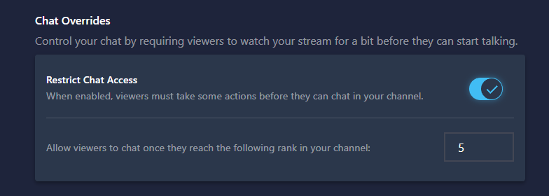
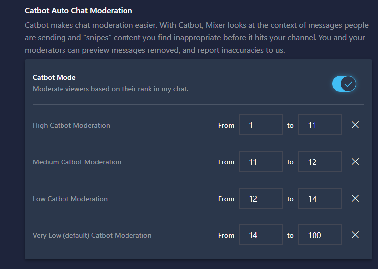

Hey Everyone, as mentioned on our [blog](https://blog/mixer.com?target=_blank) we're launching some new features today to help manage chat's volume and toxicity on Mixer with the goal of making Mixer safe and welcome for everyone.

Two features are launching in this area. There should be minimal change for developers but here is some documentation on them to help.

## Channel Progression Rank Level Restrictions
This feature lets a streamer control which channel progression rank a User must be before they are allowed to speak in a channel’s chat.


### Developer Info

This feature adds a new preference to the channel preferences object returned in any API endpoint which returns a Channel's Preferences:
```json
{
    #... Regular channels response
    "preferences": {
        #... Other Preferences
        "channel:users:ascensionLevelRestrict": 5
    }
}
```

Additionally, a new error message will be returned from chat when a user sends a message at a Channel Progression level lower than this is set. It is structured as follows:
`{"type":"reply","error":{"code":4007,"message":"You need to be level 50 in this channel to chat."},"id":5}`

## Channel Progression Based CAT Bot Scaling
With this new feature, a user’s CAT Bot treatment is altered depending on their Channel Progression rank. For example at a lower channel progressing rank your messages might have HIGH CATBot Treatment and at a high rank you’ll have a LOW CATBot Treatment.


### Developer Info

This feature adds a two new preferences to the channel preferences object returned in any API endpoint which returns a Channel's Preferences:

The first called `channel:catbot:enableascensionranges` controls if the custom CATBot Levels are enabled or not. The second ``channel:catbot:ascensionranges` is an object with a structure which defines the level range and catbot setting for 4 Brackets.

An example snippet of a preferences object with the new preferences is below.

channel:catbot:enableascensionranges": true,
```json
{
    #... Regular channels response
    "preferences": {
        #... Other Preferences
        "channel:catbot:enableascensionranges": true,
        "channel:catbot:ascensionranges": {
            "1": {
                "minLevel": 14,
                "maxLevel": 100
            },
            "2": {
                "minLevel": 12,
                "maxLevel": 13
            },
            "3": {
                "minLevel": 11,
                "maxLevel": 11
            },
            "4": {
                "minLevel": 1,
                "maxLevel": 10
            }
        }
    }
}
```

## Questions

If you have questions please feel free to [contact us](mailto:mixerdevinfo@microsoft.com)

